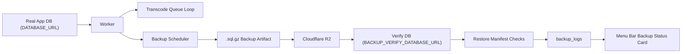

# Redprint Worker Architecture

이 문서는 레드프린트 워커 저장소의 큰 구조를 설명합니다.

쉽게 말해:
- 백업 기계가 어디서 돌고
- 트랜스코드 기계가 무엇을 하고
- 메뉴바 상태판이 무엇을 읽고
- 데이터가 어디를 오가는지
를 한 장으로 설명하는 문서입니다.

## What This Repo Contains

이 저장소에는 크게 세 가지가 있습니다.

1. 워커 런타임
   - 큐에서 트랜스코드 잡을 가져와 처리하는 백그라운드 기계
2. 백업 파이프라인
   - PostgreSQL 백업 파일을 만들고, R2에 올리고, verify DB라는 연습장 DB에 다시 부어보는 백업 기계
3. 메뉴바 모니터 앱
   - macOS 메뉴바에서 워커 상태, 잡 통계, 백업 상태 카드를 보여주는 상태판

## High-Level Components

핵심 파일:

- [scripts/transcode-worker.ts](/Users/jiwoo/Downloads/projects/transcode-worker/scripts/transcode-worker.ts)
  워커 진입점
- [runner.ts](/Users/jiwoo/Downloads/projects/transcode-worker/src/lib/transcode/worker/runner.ts)
  트랜스코드 메인 루프
- [backup-scheduler.ts](/Users/jiwoo/Downloads/projects/transcode-worker/src/lib/backup/backup-scheduler.ts)
  백업 스케줄러와 백업 실행 파이프라인
- [backup-verify.ts](/Users/jiwoo/Downloads/projects/transcode-worker/src/lib/backup/backup-verify.ts)
  verify DB 복원 검증 엔진
- [index.html](/Users/jiwoo/Downloads/projects/transcode-worker/monitor-app/src/index.html)
  메뉴바 백업 상태 카드 화면
- [db.rs](/Users/jiwoo/Downloads/projects/transcode-worker/monitor-app/src-tauri/src/db.rs)
  메뉴바 앱이 읽는 PostgreSQL 조회 계층

## System Picture

쉽게 말해:
- 진짜 서비스 DB에서 백업 상자를 만든다
- 창고(R2)에 넣는다
- 연습장 DB에 다시 열어본다
- 합격하면 기록장(`backup_logs`)에 적는다
- 메뉴바 상태판이 그 기록장을 읽어 사용자에게 보여준다

## Worker Runtime

워커는 두 가지 일을 같이 합니다.

1. 트랜스코드 잡 처리
2. 백업 스케줄 실행

[runner.ts](/Users/jiwoo/Downloads/projects/transcode-worker/src/lib/transcode/worker/runner.ts) 기준 흐름:

1. 이전에 멈춘 잡 복구
2. stale sweeper 시작
3. 백업 스케줄러 시작
4. 메인 루프에서 잡 claim
5. 트랜스코드 처리
6. 완료/실패 기록
7. 임시 디렉토리 정리

쉽게 말해:
- 워커는 한쪽으로는 영상 작업을 처리하고
- 다른 한쪽으로는 정해진 시간에 DB 백업도 같이 돌립니다

## Backup Pipeline

[backup-scheduler.ts](/Users/jiwoo/Downloads/projects/transcode-worker/src/lib/backup/backup-scheduler.ts) 기준으로 백업 파이프라인은 이렇게 움직입니다.

1. `backup_logs`에 시작 기록 남김
2. `.sql.gz` 백업 파일 생성
3. R2에 업로드
4. verify DB에 다시 복원
5. manifest / JSON / sequence 검사
6. verify DB를 즉시 다시 비움
7. 그때만 성공 기록 남김

중요한 점:
- `success`는 "파일 업로드 성공"이 아니라 "복원 검증 성공"입니다
- verify DB는 매일 새로 만드는 것이 아니라 고정된 전용 DB입니다
- 다만 검사가 끝나면 데이터는 바로 다시 비웁니다

쉽게 말해:
- 상자를 창고에 넣고 끝나는 게 아니라
- 다시 열어보고
- 합격하면 연습장 교실을 바로 치우는 구조입니다

## Verify DB

verify DB는 실서비스 DB와 별도인 전용 PostgreSQL DB입니다.

역할:
- 백업 상자를 다시 열어보는 연습장 DB

하지 말아야 할 것:
- 실제 사용자 데이터가 들어 있는 운영 DB를 verify DB로 재사용

운영 세팅과 일일 흐름은 별도 문서:
- [railway-verify-db.md](/Users/jiwoo/Downloads/projects/transcode-worker/docs/backup/railway-verify-db.md)

## Schema Sync Between Main DB And Verify DB

verify DB는 데이터는 매일 비우지만, 스키마는 메인 DB와 계속 맞아야 합니다.

중요한 이유:
- verify 엔진은 `schema_fingerprint`까지 비교하기 때문에
- verify DB 구조가 stale하면 초록불로 넘어가지 않습니다

운영 순서 문서는 별도:
- [verify-db-schema-ops.md](/Users/jiwoo/Downloads/projects/transcode-worker/docs/backup/verify-db-schema-ops.md)

## Menu Bar Monitor App

`monitor-app/`은 macOS 메뉴바 상태판입니다.

사용자가 보는 것:
- 워커가 살아 있는지
- 오늘 완료/실패한 잡 수
- 최신 백업이 `running / verifying / verified / legacy / failed` 중 무엇인지

중요한 UI 계약:
- 초록불은 restore-verified일 때만 켜짐
- 업로드만 된 상태는 `verifying`
- 옛 기록은 `legacy`

쉽게 말해:
- "상자가 창고에 있다"와
- "그 상자가 실제로 다시 살아난다"를
- 다른 표시로 보여줍니다

## Important State Stores

- `DATABASE_URL`
  진짜 서비스 DB
- `BACKUP_VERIFY_DATABASE_URL`
  백업 복원 검증용 연습장 DB
- `R2`
  백업 상자를 올려두는 창고
- `backup_logs`
  메뉴바 상태 카드와 운영자가 읽는 기록장

## Operational Docs

빠르게 찾아갈 문서:

- 운영 입구: [docs/README.md](/Users/jiwoo/Downloads/projects/transcode-worker/docs/README.md)
- Railway verify DB 운영: [railway-verify-db.md](/Users/jiwoo/Downloads/projects/transcode-worker/docs/backup/railway-verify-db.md)
- schema 변경 시 verify DB 운영: [verify-db-schema-ops.md](/Users/jiwoo/Downloads/projects/transcode-worker/docs/backup/verify-db-schema-ops.md)
- 현재 구현 계약서: [phase-3-implementation-plan-verified-backup.md](/Users/jiwoo/Downloads/projects/transcode-worker/tasks/db-backup/phase-3-implementation-plan-verified-backup.md)
- rollout 체크리스트: [phase-4-rollout-checklist.md](/Users/jiwoo/Downloads/projects/transcode-worker/tasks/db-backup/phase-4-rollout-checklist.md)
